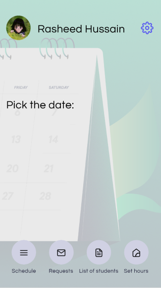

# InnoHours.Android
## Description
Mobile application that simplifies the interaction of students and professors with office 

## Screenshots

## Features
- Students can easily see professor’s available office hours and remotely apply for them
- Professors can specify the office hours that students can apply to
- Everyone can see their actual schedule in a handy way

## Getting Started
1. Download and install Android Studio
2. Clone or download this repository 
3. Build project

## Requirements
- Installed Kotlin plugin
- [Kodein-DI](https://github.com/Kodein-Framework/Kodein-DI)
- [MongoDB](https://www.mongodb.com/)
